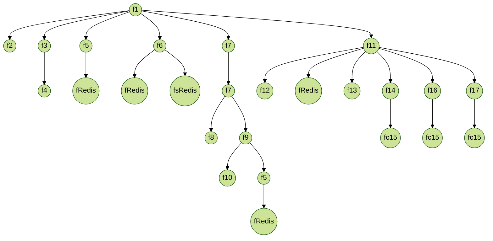

```mermaid
    %%{init: {'theme':'forest'}}%%
    flowchart TD
      Wgszl40BcZVd_SgUK2CY(( f1 )) --> Uwszl40BcZVd_SgUK2CY(( f2 ))
      Wgszl40BcZVd_SgUK2CY(( f1 )) --> aAszl40BcZVd_SgUK2CY(( f3 ))
      aAszl40BcZVd_SgUK2CY(( f3 )) --> Xgszl40BcZVd_SgUK2CY(( f4 ))
      Wgszl40BcZVd_SgUK2CY(( f1 )) --> agszl40BcZVd_SgUK2CY(( f5 ))
      agszl40BcZVd_SgUK2CY(( f5 )) --> awszl40BcZVd_SgUK2CY(( fRedis ))
      Wgszl40BcZVd_SgUK2CY(( f1 )) --> egszl40BcZVd_SgUK2CY(( f6 ))
      egszl40BcZVd_SgUK2CY(( f6 )) --> jQszl40BcZVd_SgUK2CY(( fRedis ))
      egszl40BcZVd_SgUK2CY(( f6 )) --> kAszl40BcZVd_SgUK2CY(( fsRedis ))
      Wgszl40BcZVd_SgUK2CY(( f1 )) --> ggszl40BcZVd_SgUK2CY(( f7 ))
      ggszl40BcZVd_SgUK2CY(( f7 )) --> oAszl40BcZVd_SgUK2CY(( f7 ))
      oAszl40BcZVd_SgUK2CY(( f7 )) --> iQszl40BcZVd_SgUK2CY(( f8 ))
      oAszl40BcZVd_SgUK2CY(( f7 )) --> igszl40BcZVd_SgUK2CY(( f9 ))
      igszl40BcZVd_SgUK2CY(( f9 )) --> lgszl40BcZVd_SgUK2CY(( f10 ))
      igszl40BcZVd_SgUK2CY(( f9 )) --> BO4zl40BpUSAXsPKL1E9(( f5 ))
      BO4zl40BpUSAXsPKL1E9(( f5 )) --> pQszl40BcZVd_SgUK2CY(( fRedis ))
      Wgszl40BcZVd_SgUK2CY(( f1 )) --> rQszl40BcZVd_SgUK2CY(( f11 ))
      rQszl40BcZVd_SgUK2CY(( f11 )) --> vAszl40BcZVd_SgUK2CY(( f12 ))
      rQszl40BcZVd_SgUK2CY(( f11 )) --> vgszl40BcZVd_SgUK2CY(( fRedis ))
      rQszl40BcZVd_SgUK2CY(( f11 )) --> vwszl40BcZVd_SgUK2CY(( f13 ))
      rQszl40BcZVd_SgUK2CY(( f11 )) --> Ee4zl40BpUSAXsPKL1E9(( f14 ))
      Ee4zl40BpUSAXsPKL1E9(( f14 )) --> wQszl40BcZVd_SgUK2CY(( fc15 ))
      rQszl40BcZVd_SgUK2CY(( f11 )) --> Gmwzl40BQ0y9xY4gM0dK(( f16 ))
      Gmwzl40BQ0y9xY4gM0dK(( f16 )) --> Imwzl40BQ0y9xY4gM0dK(( fc15 ))
      rQszl40BcZVd_SgUK2CY(( f11 )) --> JGwzl40BQ0y9xY4gM0dK(( f17 ))
      JGwzl40BQ0y9xY4gM0dK(( f17 )) --> Fmwzl40BQ0y9xY4gM0dK(( fc15 ))
```