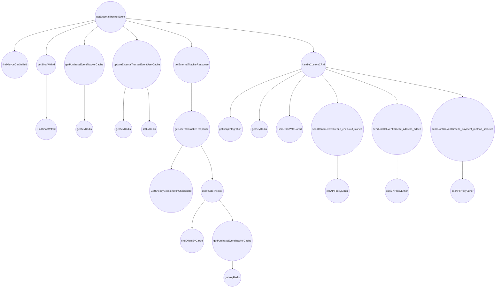

```mermaid
    flowchart TD
      Wgszl40BcZVd_SgUK2CY(( getExternalTrackerEvent )) --> Uwszl40BcZVd_SgUK2CY(( findMaybeCartWithId ))
      Wgszl40BcZVd_SgUK2CY(( getExternalTrackerEvent )) --> aAszl40BcZVd_SgUK2CY(( getShopWithId ))
      aAszl40BcZVd_SgUK2CY(( getShopWithId )) --> Xgszl40BcZVd_SgUK2CY(( FindShopWithId ))
      Wgszl40BcZVd_SgUK2CY(( getExternalTrackerEvent )) --> agszl40BcZVd_SgUK2CY(( getPurchaseEventTrackerCache ))
      agszl40BcZVd_SgUK2CY(( getPurchaseEventTrackerCache )) --> awszl40BcZVd_SgUK2CY(( getKeyRedis ))
      Wgszl40BcZVd_SgUK2CY(( getExternalTrackerEvent )) --> egszl40BcZVd_SgUK2CY(( updateExternalTrackerEventUserCache ))
      egszl40BcZVd_SgUK2CY(( updateExternalTrackerEventUserCache )) --> jQszl40BcZVd_SgUK2CY(( getKeyRedis ))
      egszl40BcZVd_SgUK2CY(( updateExternalTrackerEventUserCache )) --> kAszl40BcZVd_SgUK2CY(( setExRedis ))
      Wgszl40BcZVd_SgUK2CY(( getExternalTrackerEvent )) --> ggszl40BcZVd_SgUK2CY(( getExternalTrackerResponse ))
      ggszl40BcZVd_SgUK2CY(( getExternalTrackerResponse )) --> oAszl40BcZVd_SgUK2CY(( getExternalTrackerResponse ))
      oAszl40BcZVd_SgUK2CY(( getExternalTrackerResponse )) --> iQszl40BcZVd_SgUK2CY(( GetShopifySessionWithCheckoutId ))
      oAszl40BcZVd_SgUK2CY(( getExternalTrackerResponse )) --> igszl40BcZVd_SgUK2CY(( clientSideTracker ))
      igszl40BcZVd_SgUK2CY(( clientSideTracker )) --> lgszl40BcZVd_SgUK2CY(( findOffersByCartId ))
      igszl40BcZVd_SgUK2CY(( clientSideTracker )) --> BO4zl40BpUSAXsPKL1E9(( getPurchaseEventTrackerCache ))
      BO4zl40BpUSAXsPKL1E9(( getPurchaseEventTrackerCache )) --> pQszl40BcZVd_SgUK2CY(( getKeyRedis ))
      Wgszl40BcZVd_SgUK2CY(( getExternalTrackerEvent )) --> rQszl40BcZVd_SgUK2CY(( handleCustomCRM ))
      rQszl40BcZVd_SgUK2CY(( handleCustomCRM )) --> vAszl40BcZVd_SgUK2CY(( getShopIntegration ))
      rQszl40BcZVd_SgUK2CY(( handleCustomCRM )) --> vgszl40BcZVd_SgUK2CY(( getKeyRedis ))
      rQszl40BcZVd_SgUK2CY(( handleCustomCRM )) --> vwszl40BcZVd_SgUK2CY(( FindOrderWithCartId ))
      rQszl40BcZVd_SgUK2CY(( handleCustomCRM )) --> Ee4zl40BpUSAXsPKL1E9(( sendContloEvent:breeze_checkout_started ))
      Ee4zl40BpUSAXsPKL1E9(( sendContloEvent:breeze_checkout_started )) --> wQszl40BcZVd_SgUK2CY(( callAPIProxyEither ))
      rQszl40BcZVd_SgUK2CY(( handleCustomCRM )) --> Gmwzl40BQ0y9xY4gM0dK(( sendContloEvent:breeze_address_added ))
      Gmwzl40BQ0y9xY4gM0dK(( sendContloEvent:breeze_address_added )) --> Imwzl40BQ0y9xY4gM0dK(( callAPIProxyEither ))
      rQszl40BcZVd_SgUK2CY(( handleCustomCRM )) --> JGwzl40BQ0y9xY4gM0dK(( sendContloEvent:breeze_payment_method_selected ))
      JGwzl40BQ0y9xY4gM0dK(( sendContloEvent:breeze_payment_method_selected )) --> Fmwzl40BQ0y9xY4gM0dK(( callAPIProxyEither ))
```